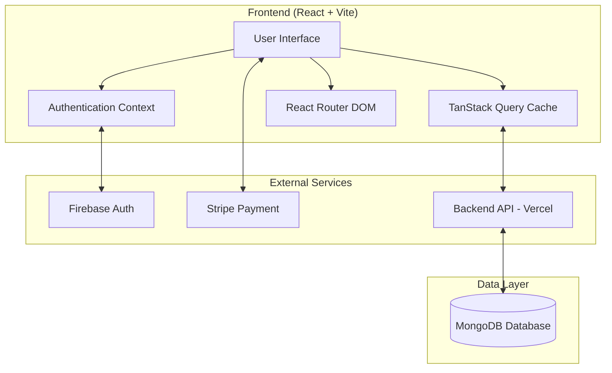
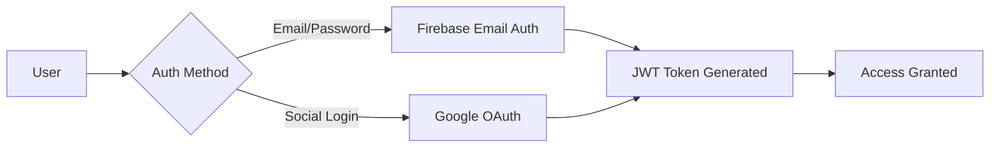
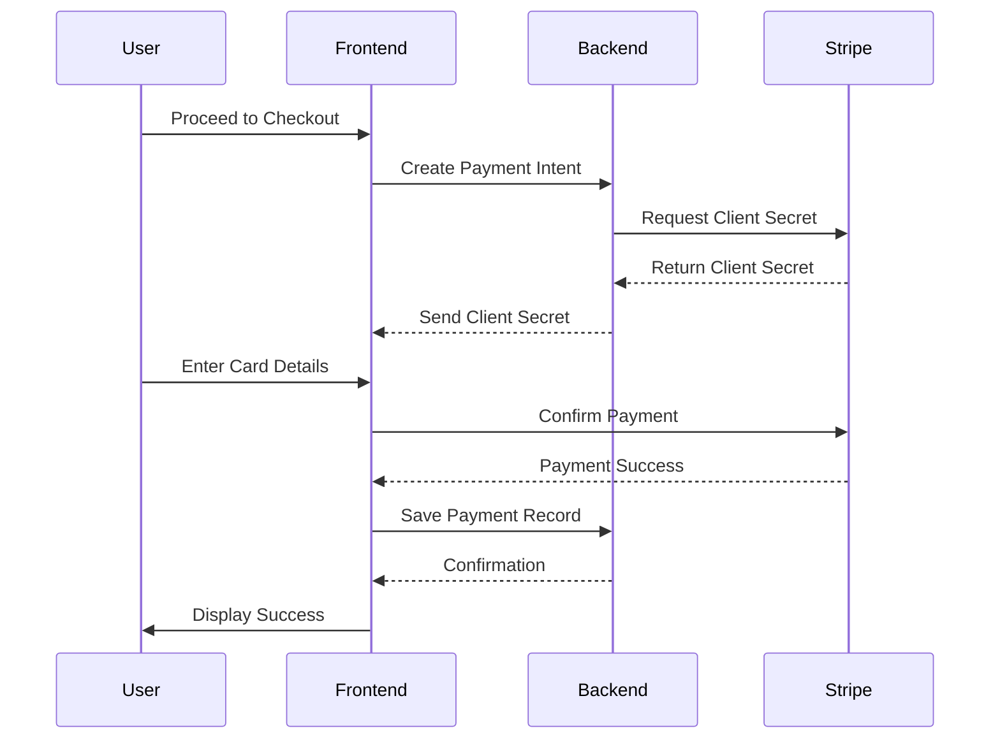
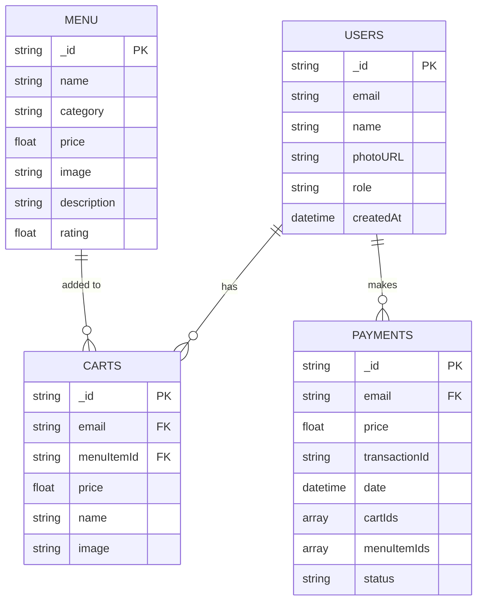

# FoodCart - Online Food Ordering System

## A Modern Food Ordering Frontend System

---

## Table of Contents

1. [Executive Summary](#executive-summary)
2. [Introduction](#introduction)
3. [Problem Statement](#problem-statement)
4. [Objectives](#objectives)
5. [System Architecture](#system-architecture)
6. [Technology Stack](#technology-stack)
7. [Features & Modules](#features--modules)
8. [Database Design](#database-design)
9. [Security Implementation](#security-implementation)
10. [Screenshots & UI Design](#screenshots--ui-design)
11. [Future Enhancements](#future-enhancements)
12. [Conclusion](#conclusion)
13. [References](#references)

---

## Executive Summary

FoodCart is a modern, full-stack web application designed to provide a seamless online food ordering experience. The system enables customers to browse food menus, add items to cart, and complete secure online payments. Built using React.js with a focus on performance, user experience, and scalability, this project demonstrates the implementation of modern web development practices including authentication, payment gateway integration, and role-based access control.

---

## Introduction

### Background

The food delivery industry has experienced exponential growth, particularly accelerated by changing consumer behaviors and the demand for convenience. This project addresses the need for a robust, user-friendly platform that connects customers with restaurant services through a digital interface.

### Project Scope

FoodCart is a client-side application that serves as the frontend for an online food ordering system. It communicates with a backend server (deployed on Vercel) to manage data persistence, authentication tokens, and payment processing.

---

## Problem Statement

Traditional food ordering methods face several challenges:

- **Limited accessibility** - Physical restaurant visits are time-consuming
- **Inefficient ordering process** - Phone orders are prone to miscommunication
- **Payment inconvenience** - Cash-only transactions limit customer convenience
- **Order tracking** - Customers lack visibility into their order history

### Solution

FoodCart addresses these challenges by providing:

- A responsive web interface accessible from any device
- Visual menu browsing with detailed item descriptions
- Secure online payment processing
- Comprehensive order and payment history tracking

---

## Objectives

### Primary Objectives

1. Develop a responsive, user-friendly food ordering interface
2. Implement secure user authentication with multiple sign-in options
3. Integrate payment gateway for secure transactions
4. Create role-based dashboards for users and administrators

### Secondary Objectives

1. Ensure cross-device compatibility
2. Optimize application performance
3. Implement SEO best practices
4. Provide engaging UI with smooth animations

---

## System Architecture



### Architecture Overview

| Layer             | Technology                   | Purpose                   |
| ----------------- | ---------------------------- | ------------------------- |
| Presentation      | React 18 + TailwindCSS       | User interface rendering  |
| State Management  | TanStack Query + Context API | Server state & auth state |
| Routing           | React Router DOM v6          | Client-side navigation    |
| Authentication    | Firebase Auth                | User identity management  |
| Payments          | Stripe.js                    | Payment processing        |
| API Communication | Axios                        | HTTP client for backend   |

---

## Technology Stack

### Frontend Technologies

| Technology           | Version | Purpose                       |
| -------------------- | ------- | ----------------------------- |
| **React**            | 18.2.0  | Component-based UI library    |
| **Vite**             | 5.1.0   | Build tool and dev server     |
| **TailwindCSS**      | 3.4.14  | Utility-first CSS framework   |
| **DaisyUI**          | 4.12.2  | TailwindCSS component library |
| **React Router DOM** | 6.22.1  | Client-side routing           |
| **TanStack Query**   | 5.50.1  | Server state management       |
| **Axios**            | 1.7.2   | HTTP client                   |

### Authentication & Security

| Technology        | Purpose                                             |
| ----------------- | --------------------------------------------------- |
| **Firebase Auth** | User authentication (Email/Password + Google OAuth) |
| **JWT Tokens**    | API request authorization                           |

### Payment Integration

| Technology       | Purpose                   |
| ---------------- | ------------------------- |
| **Stripe React** | Payment UI components     |
| **Stripe.js**    | Secure payment processing |

### UI Enhancement Libraries

| Library                     | Purpose                    |
| --------------------------- | -------------------------- |
| **AOS (Animate on Scroll)** | Scroll-based animations    |
| **Swiper**                  | Touch slider/carousel      |
| **React Icons**             | Icon library               |
| **SweetAlert2**             | Beautiful alert dialogs    |
| **React Parallax**          | Parallax scrolling effects |

---

## Features & Modules

### 1. User Authentication Module



**Features:**

- Email and password registration/login
- Google OAuth integration
- Profile management (name, photo)
- Secure session management with JWT
- Automatic token refresh

### 2. Menu & Food Catalog Module

**Features:**

- Category-based food browsing (Salads, Pizzas, Soups, Desserts, Drinks)
- Popular menu highlights
- Featured items section
- Detailed item cards with pricing and ratings
- Responsive image galleries

### 3. Shopping Cart Module

**Features:**

- Add/remove items
- Real-time cart synchronization
- Price calculation
- Persistent cart across sessions
- Cart badge showing item count

### 4. Payment Processing Module



**Features:**

- Secure card payment via Stripe
- Payment intent creation
- Transaction ID generation
- Payment history tracking
- Error handling and validation

### 5. User Dashboard Module

**Features:**

- **User Home** - Personal dashboard overview
- **My Cart** - View and manage cart items
- **Payment** - Complete checkout process
- **Payment History** - View past transactions

### 6. Admin Dashboard Module

**Features:**

- **Admin Home** - Administrative overview
- **All Users** - User management
- Role-based access control
- Protected admin routes

### 7. Home Page Components

| Component           | Description                |
| ------------------- | -------------------------- |
| **Banner**          | Hero section with carousel |
| **Category**        | Food category navigation   |
| **PopularMenu**     | Top-selling items display  |
| **Featured**        | Promotional items section  |
| **ChefCart**        | Chef showcase section      |
| **Testimonials**    | Customer reviews           |
| **Contact**         | Contact information        |
| **HalalFoodCorner** | Specialty items section    |

---

## Database Design

### Collections Overview



---

## Security Implementation

### Authentication Security

| Feature           | Implementation                 |
| ----------------- | ------------------------------ |
| Password Handling | Firebase secure authentication |
| OAuth 2.0         | Google sign-in integration     |
| Token Management  | JWT with localStorage          |
| Session Security  | Automatic token validation     |

### Route Protection

```jsx
// Private Route Implementation
<PrivateRoute>
  <Dashboard />
</PrivateRoute>

// Admin Route Implementation
<AdminRoute>
  <AdminHome />
</AdminRoute>
```

### API Security

- Bearer token authentication for API requests
- Axios interceptors for automatic token injection
- 401/403 response handling with automatic logout
- Secure HTTPS communication

---

## Screenshots & UI Design

> - Home page
>   

> - Login/Signup pages
>   

> - Menu browsing
>   

> - Shopping cart
>  

> - Payment checkout
>   
> - Payment History
>   

> - User dashboard
>   


> - Admin dashboard

### UI Design Principles

- **Responsive Design** - Mobile-first approach using TailwindCSS
- **Modern Aesthetics** - Gradient backgrounds, rounded corners, shadows
- **Smooth Animations** - AOS library for scroll animations
- **Consistent Theming** - DaisyUI component library
- **Accessibility** - Semantic HTML and ARIA attributes

---

## Future Enhancements

### Short-term Improvements

1. **Order Tracking** - Real-time order status updates
2. **Reviews & Ratings** - Customer feedback system
3. **Wishlist** - Save favorite items
4. **Email Notifications** - Order confirmation emails

### Long-term Enhancements

1. **Mobile Application** - React Native app development
2. **Multi-restaurant Support** - Platform for multiple vendors
3. **AI Recommendations** - Personalized menu suggestions
4. **Loyalty Program** - Points and rewards system
5. **Live Chat Support** - Customer service integration

---

## Conclusion

FoodCart successfully demonstrates the implementation of a modern, full-stack web application for online food ordering. The project showcases:

- **Modern Frontend Development** - React 18 with Vite for optimal performance
- **Secure Authentication** - Firebase integration with multiple sign-in options
- **Payment Integration** - Stripe for secure transaction processing
- **Responsive Design** - TailwindCSS for cross-device compatibility
- **State Management** - TanStack Query for efficient data fetching
- **Role-Based Access** - Separate user and admin functionalities

This project serves as a comprehensive example of building production-ready web applications using current industry-standard technologies and best practices.

---

## References

1. React Documentation - https://react.dev
2. Vite Documentation - https://vitejs.dev
3. TailwindCSS Documentation - https://tailwindcss.com
4. Firebase Documentation - https://firebase.google.com/docs
5. Stripe Documentation - https://stripe.com/docs
6. TanStack Query Documentation - https://tanstack.com/query
7. React Router Documentation - https://reactrouter.com

---

## Appendix

### Project Dependencies

```json
{
  "dependencies": {
    "@stripe/react-stripe-js": "^2.8.1",
    "@tanstack/react-query": "^5.50.1",
    "axios": "^1.7.2",
    "firebase": "^10.12.0",
    "react": "^18.2.0",
    "react-router-dom": "^6.22.1",
    "tailwindcss": "^3.4.14"
  }
}
```

### Running the Project

```bash
# Install dependencies
npm install

# Start development server
npm run dev

# Build for production
npm run build

# Preview production build
npm run preview
```

---

**Prepared by:** Muttakin Islam Hasib  
**Student ID:** 2241091003
**Course:** Web Programming
**Submission Date:** 12 January 2026
